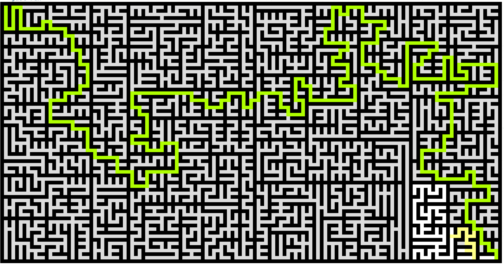

# mazes

Terminal maze generator and solver. Watches mazes build themselves, then watches them get solved.



```
just run
just run -- --builder recursive-backtracker --solver bfs
just run -- --style lines --build-steps 100
```

## Controls

| Key         | Action                           |
| ----------- | --------                         |
| `q` / `Esc` | Quit                             |
| `n`         | New maze                         |
| `b` / `B`   | Cycle builder forward / backward |
| `r`         | Random builder mode              |
| `p`         | Pause / unpause                  |
| `.`         | Step one frame (while paused)    |
| `→`         | Skip one second                  |

## Options

```
-b, --builder <name>     Pin the maze builder
-r, --random             Random builder each time (default)
-s, --solver <name>      Pin the maze solver
    --build-steps <n>    Steps per tick during build  (default: 15)
    --solve-steps <n>    Steps per tick during solve  (default: 15)
    --build-sleep <s>    Seconds between build ticks  (default: 0.0667)
    --solve-sleep <s>    Seconds between solve ticks  (default: 0.0667)
    --wait <s>           Seconds to show completed maze (default: 2)
    --style <style>      lines | blocks | half-blocks  (default: half-blocks)
-h, --help               Show help
```

## Builders

| Name                    | Character                                                                                     |
| ------                  | -----------                                                                                   |
| `recursive-backtracker` | Long winding corridors, deep DFS feel                                                         |
| `prim`                  | Dense branchy texture, grows outward from a seed                                              |
| `kruskal`               | Uniform random edges, evenly chaotic                                                          |
| `wilson`                | Loop-erased random walks, provably unbiased                                                   |
| `aldous-broder`         | Pure random walk, also unbiased but slow to finish                                            |
| `houston`               | Aldous-Broder until ~50% then Hunt-and-Kill — fast and unbiased                               |
| `hunt-and-kill`         | Corridor-heavy with a subtle scan bias                                                        |
| `growing-tree`          | Mixes DFS and random picks — long corridors with branches                                     |
| `eller`                 | Generates row-by-row in linear memory                                                         |
| `sidewinder`            | Horizontal runs with random vertical connections                                              |
| `binary-tree`           | Fastest; strong diagonal bias toward one corner                                               |
| `recursive-division`    | Carves rooms by repeatedly splitting space with walls                                         |
| `spiral-backtracker`    | DFS with a rotational direction bias, forms spirals                                           |
| `braided`               | Removes all dead ends — every cell has multiple exits, no backtracking needed                 |
| `origin-shift`          | Starts as a snake path, randomly walks an origin and flips edges; every frame is a valid maze |

## Solvers

| Name         | Strategy                                                    |
| ------       | ----------                                                  |
| `bfs`        | Shortest path guaranteed; marks dead branches as it expands |
| `dfs`        | Follows corridors greedily, backtracks when stuck           |
| `flood-fill` | Expands in all directions simultaneously                    |

## Build

```sh
cargo build --release   # ~500K binary
cargo test
```

Requires a terminal. Uses `stty` for raw mode — no runtime dependencies beyond the stdlib and `terminal_size`.
